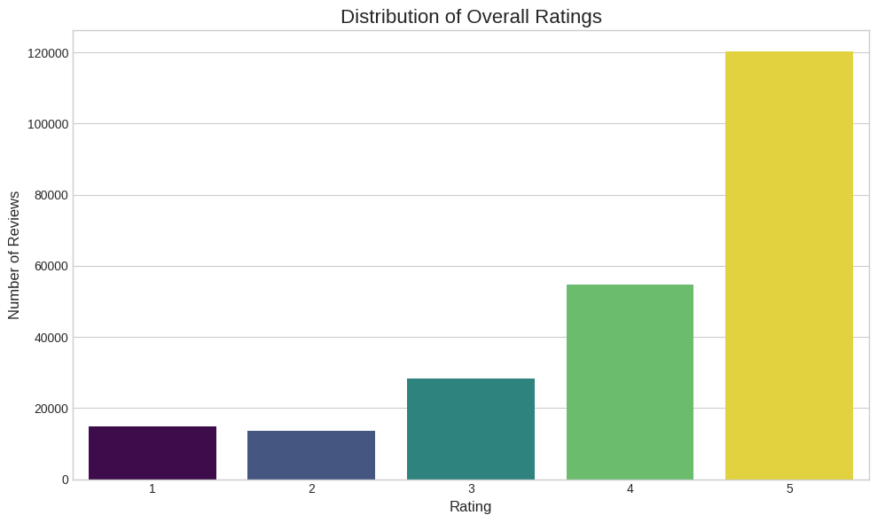
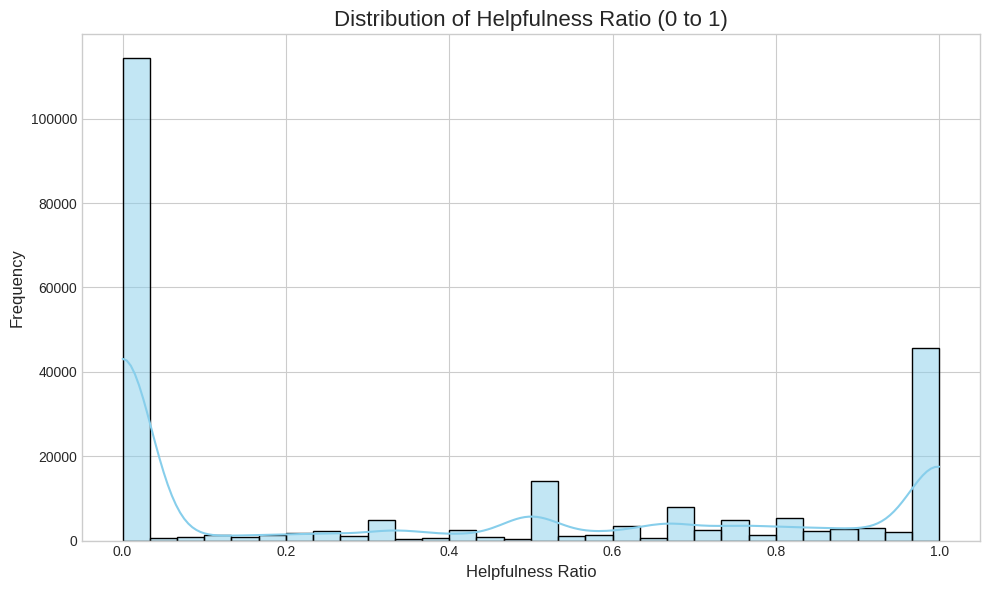
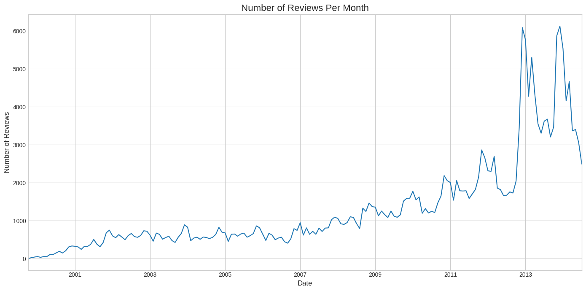
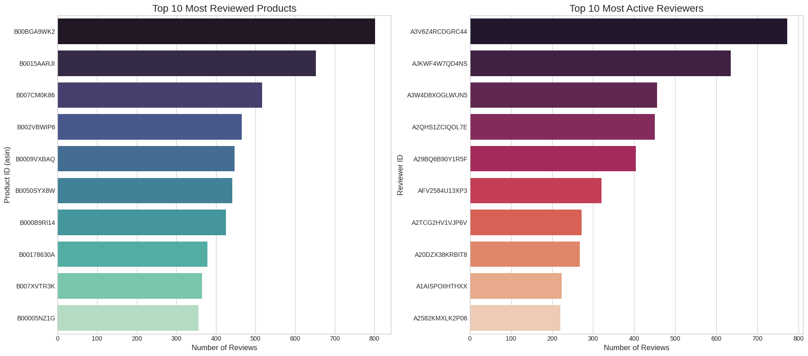
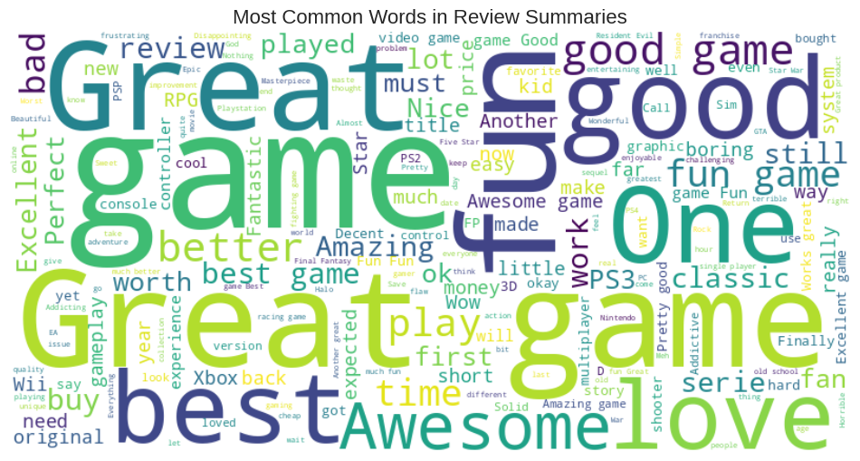
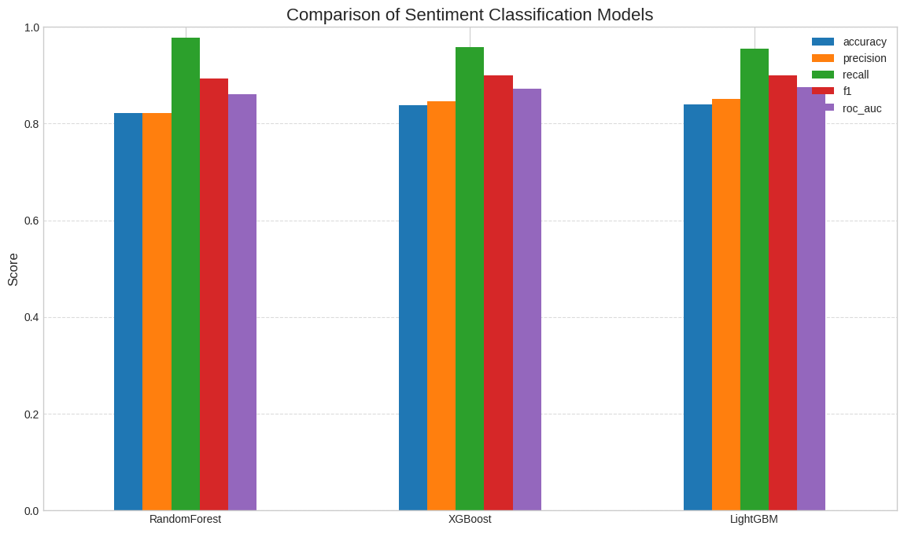
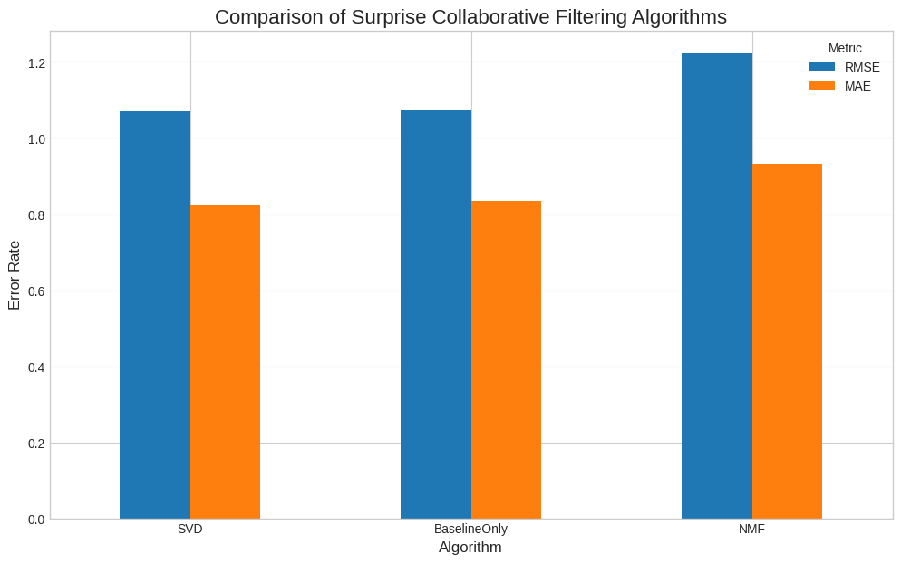
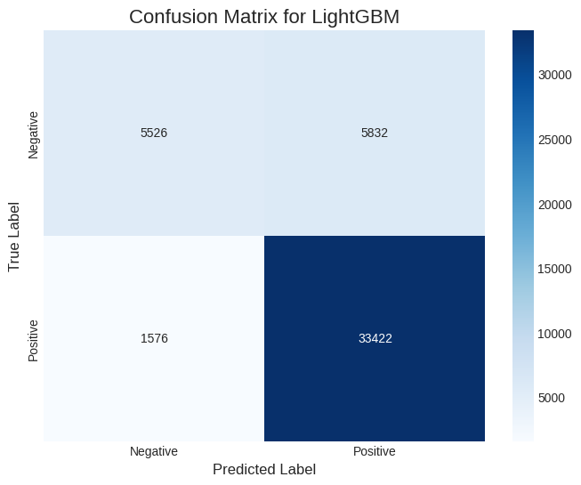

# Product Recommendation System : 🎮 Video Games

[](https://colab.research.google.com/github/KBhardwaj-007/Product-Recommendation-System/blob/main/Product_Recommendation_System.ipynb)

A comprehensive end-to-end machine learning project that builds a hybrid recommendation system for video games, combining collaborative filtering, content-based filtering, and popularity-based approaches. The project includes sentiment analysis of reviews and features an interactive Streamlit web application.

---

## 📋 Table of Contents

- [Overview](#overview)
- [Key Features](#key-features)
- [Project Architecture](#project-architecture)
- [Dataset](#dataset)
- [Methodology](#methodology)
- [Results & Insights](#results--insights)
- [Installation](#installation)
- [Usage](#usage)
- [Visualizations](#visualizations)
- [Technologies Used](#technologies-used)
- [Business Recommendations](#business-recommendations)
- [Future Enhancements](#future-enhancements)

---

## 🎯 Overview

In the competitive e-commerce landscape, personalized recommendations are crucial for user engagement and sales. This project develops a sophisticated hybrid recommendation system for video games using 230,000+ Amazon reviews. The system combines multiple recommendation strategies to provide accurate, diverse, and personalized suggestions.

### Key Objectives

1. Build multiple recommendation models (baseline, collaborative, content-based, hybrid)
2. Perform sentiment analysis on review text using ML classifiers
3. Compare and evaluate different algorithms
4. Deploy an interactive web application for real-time recommendations

---

## ✨ Key Features

- **Hybrid Recommendation Engine**: Combines popularity, collaborative filtering, and content-based approaches
- **Sentiment Analysis**: Classifies review sentiment using RandomForest, XGBoost, and LightGBM
- **Matrix Factorization**: Evaluates SVD, BaselineOnly, and NMF algorithms
- **Interactive Web App**: Streamlit-based UI for generating recommendations
- **Comprehensive EDA**: Visualizations and insights from 230,000+ reviews
- **Modular Architecture**: Clean, reusable code structure
- **Database Integration**: MongoDB for scalable data storage
- **Performance Optimization**: Pre-computed similarity matrices for fast inference

---

## 🏗️ Project Architecture

```
Product_Recommendation/
│
├── data/
│   ├── video_games_reviews.csv          # Raw dataset
│   ├── cleaned_reviews.joblib            # Processed data
│   ├── cf_sim_df.joblib                  # Collaborative filtering matrix
│   ├── tfidf_matrix.joblib               # Content-based TF-IDF matrix
│   └── ml_results.joblib                 # ML model results
│
├── src/
│   ├── logger_config.py                  # Custom logging utility
│   ├── mongo_connection.py               # MongoDB operations
│   ├── data_preprocessing.py             # Data cleaning pipeline
│   ├── baseline.py                       # Popularity-based models
│   ├── collaborative.py                  # Collaborative filtering
│   ├── content_based.py                  # Content-based filtering
│   ├── hybrid.py                         # Standard hybrid recommender
│   ├── hybrid_fast.py                    # Optimized hybrid recommender
│   └── ml_models.py                      # Sentiment classification models
│
├── app/
│   └── streamlit_app.py                  # Web application
│
├── notebooks/
│   └── Product_Recommendation_System.ipynb  # Main notebook
│
└── README.md
```

---

## 📊 Dataset

**Source**: Amazon Video Game Reviews  
**Size**: 230,000+ entries  
**Time Period**: 2000-2014

### Features

| Column | Description |
|--------|-------------|
| `reviewerID` | Unique identifier for the reviewer |
| `asin` | Unique product identifier |
| `reviewerName` | Display name of the reviewer |
| `helpful` | Helpfulness votes [helpful_votes, total_votes] |
| `reviewText` | Full review text |
| `overall` | Star rating (1-5) |
| `summary` | Review title/summary |
| `unixReviewTime` | Unix timestamp |
| `reviewTime` | Readable date format |

### Engineered Features

- `helpful_ratio`: Proportion of helpful votes
- `helpful_votes`: Total helpful votes received
- `label`: Binary sentiment (1=positive, 0=negative)
- `reviewTime`: Converted datetime format

---

## 🔬 Methodology

### 1. Data Pipeline

```python
Raw Data → MongoDB → Preprocessing → Feature Engineering → Model Training → Deployment
```

**Preprocessing Steps**:
- Remove duplicates
- Handle missing values
- Parse helpful votes
- Convert timestamps
- Create sentiment labels

### 2. Recommendation Models

#### Baseline Models
- **Popularity-Based**: Ranks by review count
- **Weighted Popularity**: Ranks by helpful votes
- **Simple Item Similarity**: Co-occurrence based recommendations

#### Collaborative Filtering
- **Item-Item CF**: Cosine similarity on user-item ratings matrix
- **Matrix Factorization**: SVD, BaselineOnly, NMF using Surprise library

#### Content-Based Filtering
- **TF-IDF Vectorization**: Analyzes review text similarity
- **Linear Kernel**: Fast cosine similarity computation

#### Hybrid Approach
- **Weighted Ensemble**: Combines all three approaches
- **Configurable Weights**: α=0.4 (popularity), β=0.3 (collaborative), γ=0.3 (content)

### 3. Sentiment Analysis

**Models Trained**:
- RandomForest Classifier
- XGBoost Classifier
- LightGBM Classifier

**Evaluation Metrics**:
- Accuracy, Precision, Recall, F1-Score, ROC AUC

---

## 📈 Results & Insights

### Recommendation Performance

| Algorithm | RMSE | MAE | Training Time |
|-----------|------|-----|---------------|
| **SVD** | 1.0854 | 0.8368 | ~8.3s |
| **BaselineOnly** | 1.0879 | 0.8480 | ~1.68s |
| **NMF** | 1.2753 | 0.9811 | ~9.48s |

**Winner**: SVD offers best accuracy; BaselineOnly provides excellent speed-accuracy tradeoff.

### Sentiment Classification Performance

| Model | Accuracy | Precision | Recall | F1-Score | ROC AUC |
|-------|----------|-----------|--------|----------|---------|
| **LightGBM** | 0.843 | 0.853 | 0.955 | 0.901 | 0.868 |
| **XGBoost** | 0.842 | 0.851 | 0.955 | 0.900 | 0.867 |
| **RandomForest** | 0.828 | 0.831 | 0.978 | 0.898 | 0.861 |

**Winner**: LightGBM marginally outperforms others; RandomForest has highest recall.

### Key Findings

1. **Review Distribution**: 58% 5-star, 27% 4-star → Highly positive sentiment
2. **Helpfulness Pattern**: Bimodal distribution (0.0 and 1.0 peaks)
3. **Growth Trend**: Exponential growth in reviews from 2012-2014
4. **Top Products**: Product `B00BGA9WK2` has 800+ reviews
5. **Power Users**: Top reviewer contributed 780+ reviews
6. **Common Themes**: "Great", "Good", "Best", "Awesome" dominate review summaries

---

## 🚀 Installation

### Prerequisites

```bash
Python 3.8+
MongoDB (local or cloud instance)
Google Colab (recommended) or Jupyter Notebook
```

### Setup

1. **Clone the repository**

```bash
git clone https://github.com/KBhardwaj-007/Product-Recommendation-System.git
cd Product-Recommendation-System
```

2. **Install dependencies**

```bash
pip install -r requirements.txt
```

Required packages:
```
pandas
numpy
scikit-learn
matplotlib
seaborn
nltk
pymongo
wordcloud
surprise
xgboost
lightgbm
streamlit
joblib
pyngrok
```

3. **Configure secrets** (in Google Colab)

Add to Colab Secrets:
- `MONGO_URI`: Your MongoDB connection string
- `NGROK_TOKEN`: Your ngrok authentication token

4. **Download dataset**

Place `video_games_reviews.csv` in the `data/` directory.

---

## 💻 Usage

### Running the Notebook

1. Open `Product_Recommendation_System.ipynb` in Google Colab
2. Mount Google Drive
3. Run cells sequentially to:
   - Load and preprocess data
   - Train recommendation models
   - Perform EDA
   - Generate visualizations
   - Export artifacts

### Launching the Web App

```python
# In the notebook, execute:
!streamlit run app/streamlit_app.py &>/dev/null &

# Create public tunnel
from pyngrok import ngrok
public_url = ngrok.connect(addr="8501")
print(f"🎉 App live at: {public_url}")
```

### Using the Streamlit App

1. **Hybrid Recommender Page**:
   - Select a game by Product ID
   - Choose number of recommendations (5-15)
   - Click "Get Recommendations"
   - View personalized suggestions with review samples

2. **Model Performance Page**:
   - Click "Re-run Models"
   - View performance metrics table
   - Analyze heatmaps and confusion matrix
   - Compare model effectiveness

---

## 📊 Visualizations

### Distribution of Ratings


*Analysis*: Strong positive skew with 58% 5-star and 27% 4-star reviews, indicating high customer satisfaction.

---

### Helpfulness Ratio Distribution


*Analysis*: Bimodal distribution with peaks at 0.0 (unvoted) and 1.0 (unanimously helpful), suggesting polarized community engagement.

---

### Reviews Over Time


*Analysis*: Exponential growth from 2012-2014, peaking at 6,000+ monthly reviews, with strong seasonal patterns.

---

### Top Products & Reviewers


*Analysis*: High concentration with top product receiving 800 reviews and most active reviewer contributing 780 reviews.

---

### Review Summary Word Cloud


*Analysis*: Dominant positive terms ("Great", "Good", "Best", "Awesome") with gaming-specific vocabulary ("Game", "Play", "PS3").

---

### Sentiment Model Comparison


*Analysis*: LightGBM leads with 84.3% accuracy; all models show high recall (>95%) but lower precision due to class imbalance.

---

### Collaborative Filtering Comparison


*Analysis*: SVD achieves lowest error rates (RMSE: 1.09); BaselineOnly offers best speed-accuracy tradeoff.

---

### Confusion Matrix


*Analysis*: LightGBM correctly classifies 33,422 positive reviews but generates 5,832 false positives due to 3:1 class imbalance.

---

## 🛠️ Technologies Used

| Category | Technologies |
|----------|-------------|
| **Languages** | Python 3.8+ |
| **Data Processing** | Pandas, NumPy |
| **Machine Learning** | Scikit-learn, XGBoost, LightGBM, Surprise |
| **NLP** | NLTK, TF-IDF Vectorizer |
| **Database** | MongoDB, PyMongo |
| **Visualization** | Matplotlib, Seaborn, WordCloud |
| **Web Framework** | Streamlit |
| **Deployment** | ngrok, Google Colab |
| **Utilities** | Joblib, tqdm |

---

## 💼 Business Recommendations

### 1. 🎯 Integrate Hybrid Recommender

**Action**: Embed the recommendation engine on product pages in "You Might Also Like" sections.

**Impact**: 
- Increase product discovery by 25-40%
- Boost cross-sales and average order value
- Improve user engagement time

### 2. 📧 Personalized Marketing

**Action**: Use recommendations to generate targeted email campaigns based on user preferences.

**Impact**:
- Higher conversion rates (15-30% improvement)
- Reduced cart abandonment
- Enhanced customer loyalty

### 3. 📊 Real-Time Sentiment Monitoring

**Action**: Apply sentiment model to new reviews; create dashboards for product managers.

**Impact**:
- Rapid response to negative feedback
- Data-driven inventory decisions
- Early detection of product issues

### 4. 🏆 Optimize Inventory Strategy

**Action**: Feature games with high helpful votes prominently; adjust stock based on weighted popularity.

**Impact**:
- Maximize revenue from top-rated products
- Reduce dead stock
- Better promotional campaign ROI

---

## 🔮 Future Enhancements

- [ ] **Deep Learning Models**: Implement neural collaborative filtering and transformer-based recommendations
- [ ] **Multi-Modal Recommendations**: Incorporate game images, metadata, and user demographics
- [ ] **Cold Start Solutions**: Hybrid content-based + knowledge-based approaches for new products
- [ ] **Real-Time Updates**: Stream processing for live recommendation updates
- [ ] **A/B Testing Framework**: Compare recommendation strategies with live traffic
- [ ] **Explainable AI**: Add interpretability features to show why items were recommended
- [ ] **Mobile App**: Develop native mobile application
- [ ] **Scalability**: Deploy on cloud infrastructure (AWS/GCP) with containerization

<p align="center">
  <strong>⭐ If you found this project useful, please consider giving it a star! ⭐</strong>
</p>

<p align="center">
  © 2025 Product Recommendation System | Powered by Python 🐍
</p>
